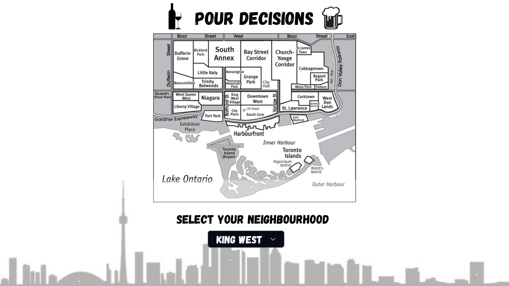

# Pour Decisions

---

### Installation Instructions: 
1.  **Clone the repository**
    
2.  **Install dependencies:**
    npm i
    
3.  **Start the server:**
    npm run dev

---

## Overview

**Pour Decisions** 🍸 is a web application that helps users discover the **best happy hour deals in downtown Toronto** based on their preferred location (specifically neighbourhood), date and time of day (morning, afternoon, evening, night). The platform is designed to quickly show users which bars and restaurants have the most favourable drink and food deals, saving time and effort when searching for happy hour specials. This will have a particular focus on drink deals but will also include some food deals.🍻

The primary focus will be to display happy hour drink deals; secondary focus will to display food deals.

There will be a comments section for people to leave reviews of the bar/restaurants in regards to drinks, food, atmosphere and overall experience. This will ensure unbiased data as data will be added by consumers.

### Problem Space

This website helps users find the best happy hour deals (drink and food) in downtown Toronto. By selecting specific criteria like time, date, and location (neighbourhood), users can easily browse a list of bars and restaurants with current offers.

While the costs of living steadily increases, its crucial to save a few bucks where you can! 💰

Don't waste time Googling differents bars or restaurants to compare which places have the best happy hours in Toronto, just visit our site!

### User Profile

The primary users will be anyone looking for **happy hour deals in downtown Toronto**, including both locals and visitors. 🥂🍾

### Features

- Filter by day of the week, time of day and location (by Toronto neighbourhood).
- Each venue in the list will show the name, address, and available drink and food specials.
- Will show drink deals primarily; will show food deals secondarily but food deals are not the main focus.
- Will have a comments section for people to leave a comment on each bar/restaurant.
- Will have a section where users can suggest bars and restaurants that should be added to the site’s database.

## Implementation

### Tech Stack

Frontend:
- React.js
- CSS/SCSS

Backend:
- Node.js
- Express.js

### APIs

- Will create my own API
- Some form of AI (possibly)
    - An AI-powered system to automatically suggest new happy hour spots by scraping data from sources like Yelp, Google Reviews, or other public databases. However, due to current issues with outdated data on AI sources, manual updates and user submissions will be key to maintaining accuracy.

### Sitemap

- **Homepage:** a page where you can select a particular neighbourhood on a the map 📍 (likely via a drop down menu).
- **Bar/Restaurant List Page:** Shows a list bars/restaurant in the area you've previously selected. Tags and Filters will help sort the data.
- **Bar/Restaurant Details Page:** once you select the bar/restaurant, it will show you the address, the deals for this particular venue and have a place for people to leave a comment to review the happy hour of the selected venue.

### Mockups

### Data

- Bars/Restaurants – Name, address, neighbourhood and happy hour details.
- User Reviews – Comments and time of submission. They may leave a name on the review if wanted but it is not a necessity; users may leave an anonymous review.

### Endpoints

1. GET /api/venues
    - Parameters: location by neighbourhood, time of day, day of the week
    - Response: List of bars/restaurants based on filter criteria.
2. GET /api/venue/:id
    - Parameters: id (bar/restaurant unique ID)
    - Response: Detailed information about the selected venue, including address, deals, and reviews.
    - POST /api/review

## Roadmap

Setup
- Set up project repository and basic folder structure.
- Initialize frontend and backend frameworks.

Create Backend
- Choose APIs and create database.

Frontend
- Implement the filter system by date, time, and neighbourhood.
- Create a simple landing page with search options and results layout.
- Display a list of venues based on filtered criteria ( may use mock data at first).
- Create individual venue pages that display venue details (name, address, happy hour specials).
- Add a basic comment section for user reviews.

---

## Future Implementations

- In the comments section, customers will be able to rate thier experience on a scale from 1-5.
- Price Filter: Add filter to be able to filter by the price range.
- Venue Type Filter: Filter by the type of bar (sports bar, dive bar, live music venue etc).
- Map integration such as Google Maps API or Leaflet.js.
- Saved items page: a place to save your favourite bars and restaurants you may way to try later.
- Reccomendations page: a page where people can suggest a bar/restaurant its associated happy hour that should be added to the database.
    - Data
        - User Suggestions – Suggested venues with details about why they should be added, including happy hour deals.
    - Endpoint
        - POST /api/suggestions
            - Parameters: suggestedVenueName, dealInfo, userComments
            - Response: Confirmation of submission and thank you note.
    - Create a simple form where users can submit suggestions for new venues (bar/restaurant + deal info).
    - Add basic validation to the form to ensure accurate submissions.

